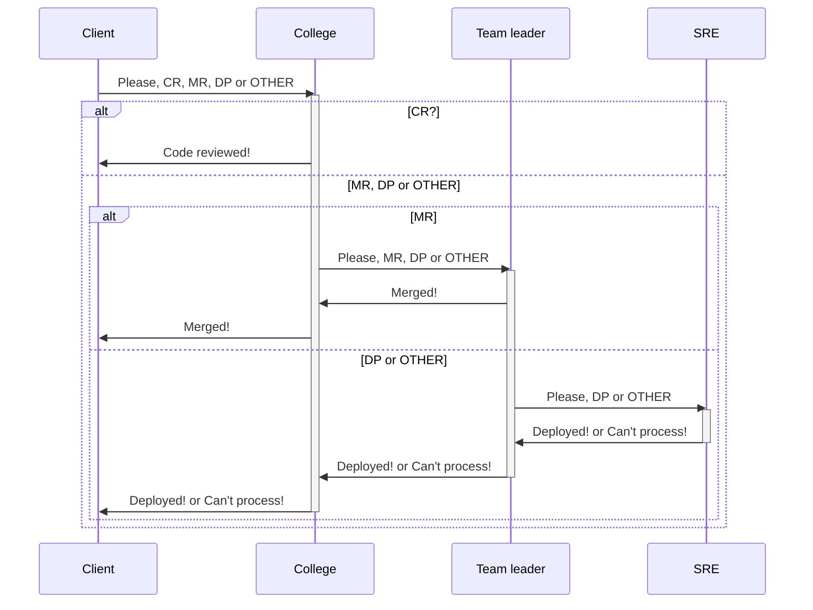

# Chain of responsibility

```mermaid
sequenceDiagram
  participant Client
  participant College
  participant Team leader
  participant SRE

  Client->>College: Please, CR, MR, DP or OTHER
  
  activate College
  alt CR?
  College->>Client: Code reviewed!
  
  else MR, DP or OTHER
  
  alt MR
  College->>Team leader: Please, MR, DP or OTHER
  activate Team leader
  Team leader->>College: Merged!
  
  College->>Client: Merged!
  
  else DP or OTHER
  Team leader->>SRE: Please, DP or OTHER
  activate SRE
  SRE->>Team leader: Deployed! or Can't process!
  
  deactivate SRE
  
  Team leader->>College: Deployed! or Can't process!
  deactivate Team leader
  
  College->>Client: Deployed! or Can't process! 
  deactivate College
  end
  end
```